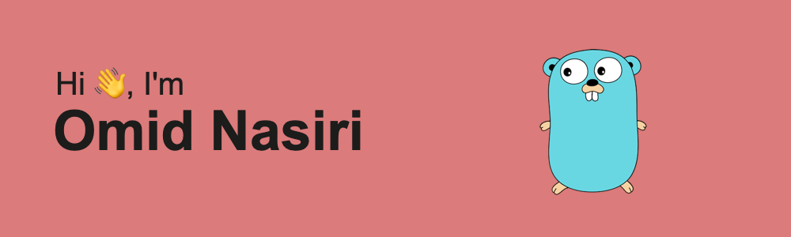

<h3 align="left">Connect with me:</h3>

 

<h3 align="left">Languages and Tools:</h3>

 
  
  
  
  
  
  

- 🔭 I’m currently working as a **Golang Developer**
- 🦸🏻 I’m looking to collaborate on: Golang, NestJS projects
- 📫 How to reach me: **omid_nasiriii@outlook.com**

 

 

